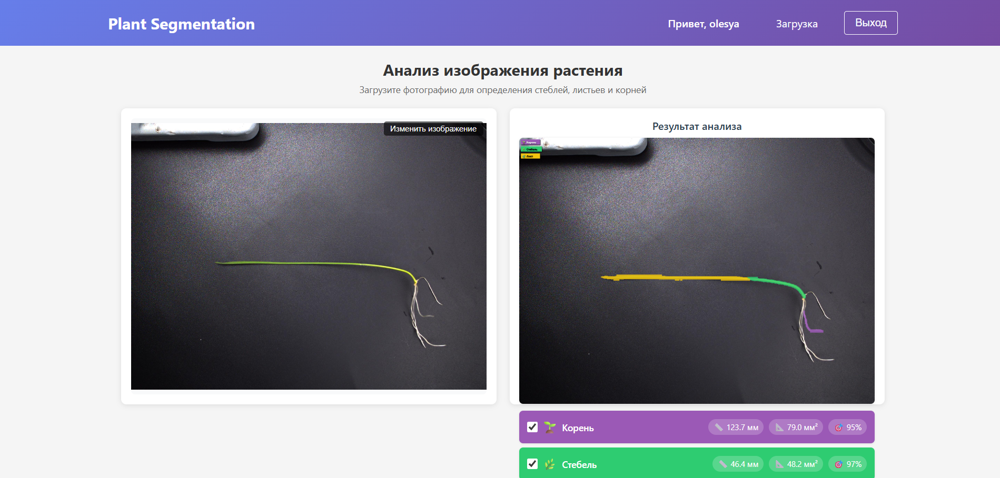
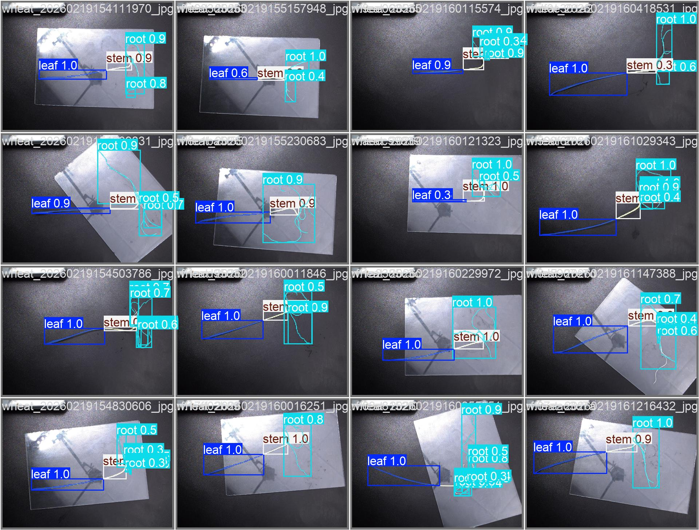
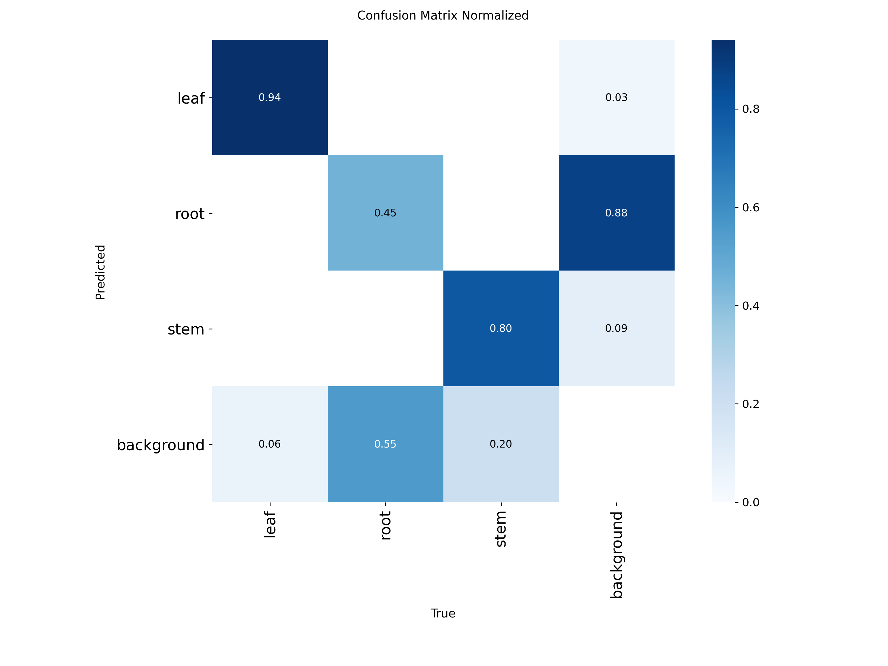

# Анализ растений

Комплексное решение для сегментации и анализа растений (пшеница, руккола) с измерением площади и длины органов. Включает консольное приложение, веб-приложение (FastAPI + React) и Telegram-бота.

## Консольное приложение

Консольная версия для пакетной обработки изображений.

### Установка и запуск
1. `pip install -r requirements.txt`
2. `python main.py -i "путь/к/файлу"`

### Параметры командной строки
| Параметр | Описание | Значение по умолчанию |
|----------|----------|----------------------|
| `-i, --input` | Папка с изображениями | **Обязательный** |
| `-o, --output` | Папка для результатов | `results` |
| `-m, --model` | Путь к модели | `best.pt` |

## Веб-приложение (FastAPI + React)

Полноценное веб-приложение с авторизацией, базой данных и историей анализов.

### Backend (FastAPI)
**Стек:** FastAPI, SQLAlchemy, MySQL/MariaDB, JWT аутентификация

**Запуск:**
```bash
cd web/back
pip install -r requirements.txt
cp .env.example .env  # Настроить БД
uvicorn app.main:app --reload --host 0.0.0.0 --port 8000
```

### API Endpoints
| Метод | Endpoint | Описание | Примечание |
|-------|----------|----------|------------|
| `POST` | `/users/` | Регистрация нового пользователя | Требует email, пароль |
| `POST` | `/token` | Получение JWT токена | Логин/пароль |
| `POST` | `/analyze` | Загрузка и анализ изображения | Требует JWT, файл |
| `GET` | `/predictions/my` | История личных анализов | Требует JWT |[file:1]

**Документация API:** http://localhost:8000/docs

### Frontend (React)
**Технологический стек:** React, React Router, Axios, React Dropzone

**Установка и запуск:**
```bash
cd web/front
npm install
npm start
```


**Рисунок 1:** Веб-интерфейс

## Сравнение обученных моделей

**Были обучены 3 модели для сегментации растений:**

| Модель | Leaf mAP50 | Root mAP50 | Stem mAP50 | ALL mAP50 |
|--------|------------|------------|------------|-----------|
| `baseline_s_1024` | **82.7%** | **20.3%** | **65.8%** | **72.3%** |
| `highres_s_1280_b4` | 81.8% | 19.6% | 64.1% | 72.7% |
| `strong_aug_s_1152` | 83.5% | 19.3% | 62.0% | 68.6% |

**На тестовой выборке:**

| Модель | Leaf mAP50 | Root mAP50 | Stem mAP50 | ALL mAP50 |
|--------|------------|------------|------------|-----------|
| `baseline_s_1024` | 73.1% | **27.0%** | **65.6%** | **74.0%** |
| `highres_s_1280_b4` | 76.5% | 21.9% | 64.0% | 74.2% |
| `strong_aug_s_1152` | 75.0% | 21.1% | 62.5% | 71.5% |

При сегментации корней лучше себя показала модель `baseline_s_1024`, поэтому она была выбрана.



**Рисунок 2:** Результаты валидационной выборки



**Рисунок 3:** Нормализованная матрица ошибок
